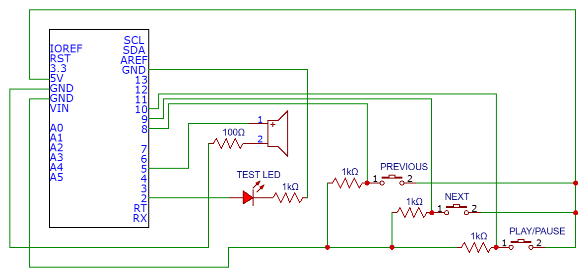
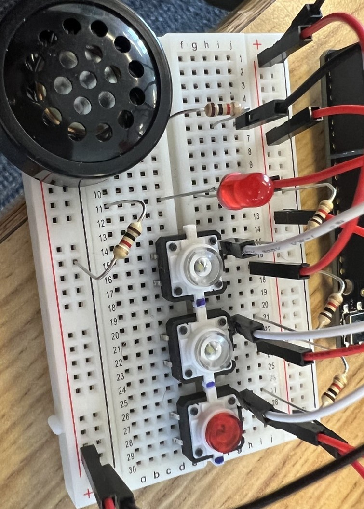

# Digital Juke Box
- An 8-bit music player, programmed in AVR Assembly on the ATMega328P Microprocessor.
- This was the final project for Whitworth's assembly class, properly known as "Computer Orginization and Assembler Programming"

## What I did on this Project
Everything except the assumptions.md and Works_Cited.md files in the Documentation subfolder

## Project Goals
At the beginning of this project, we wanted to have our software:
- Play at least 3 distinct songs
- Have a button to toggle pause and unpause while a song is playing or not playing respectively
- Have a button start playing a new song when pressed

Did we meet all these goals? No. Here are my reasons why:
- The goals were too ambitious for the 1 month timeframe. We were students, not expierenced developers. Frankly, the goal was to learn the course material, not necessairly to create flawless software. 
- My partner for this project simply did not pull their weight. More on this in the next section.
- In my view, this project was still a success because we still developed meaningful functionality and learned a lot in the process

## This was a Group Project
Another student and I were respondible for working on this project together. Truthfully, I recieved almost no help from this student. From what I could tell, they did not understand the content of the class at a high enough level to contribute. I would try my best to explain concepts in an effort to bring them up to speed, but frankly this did not work. There became a point where the project's deadline promped me to get the job done by meself. What upsetted me the most was missing out on pair programming experience. Yet, my programming skills still improved significantly after this project. WIth all that said, my attitude towards them is actually positive. They were (and still are) a kind and respectfull person, and I wish them the best in their future endeavors.

## At a Glance
This project uses Gerd's AVR Assembler. You can find it here: https://sourceforge.net/projects/gerdsavrassembl/
The assembler translates one or more .asm files into a single .hex file. This .hex file is then sent to the metro board. Upon reaching the metro board, assembly instructions are loaded into program memory of the board's microprosessor. The program begins execution immediately.

Throughout this project I have ulitized 2 datasheets: 
AVR Instruction Set Manuel: https://ww1.microchip.com/downloads/en/DeviceDoc/AVR-Instruction-Set-Manual-DS40002198A.pdf 
ATmega328P Data Sheet: https://ww1.microchip.com/downloads/en/DeviceDoc/Atmel-7810-Automotive-Microcontrollers-ATmega328P_Datasheet.pdf

## Our Software
You cannot run this project yourself unless you have the appropriate external hardware. 
For this reason I've provided a video demo: https://youtu.be/xWGmJE0x4ws

Our software at a high level:
- Upon execution, the user will hear 49 consecutive ascending notes. This was developed to ensure our software could successfully produce its full range of frequencies.
- After the ascending notes, the first part of the Star Wars main theme starts playing.
- The song can be paused and unpaused using one of our butons, although this is not 100% consistent.

*Feel free to look inside the Documentation subfolder for a deeper dive into this project*

## Takeaways
Valuable skills and knowledge I got from this project:
- Deep understanding of computer memory and data representation
- Practice in constructing layers of abstraction to divide a problem into manageable pieces
- Use subroutines/functions to encapsulate functionality
- Learned system interrupts as a new programming paradigm
- Learned how processor output effects the physics of external hardware components (such as our speaker)
- Appreciation for modern compliers knowing how tedious it would be to write all software in assembly

## Possible Improvements
- Seperate main.asm into multiple .asm files for further encapsulation of code
- Fix the button debouncing subroutines. Consider what should happen when a button transititions from unpressed to pressed, and pressed to unpressed
- Cut off the beginning and end of each note. If you've watched the demo video, the first three notes of the Star Wars main theme sound like one longer note because there is not enough distance between notes.
- Add more music baby!

## Circuit Diagram

## BreadBoard

